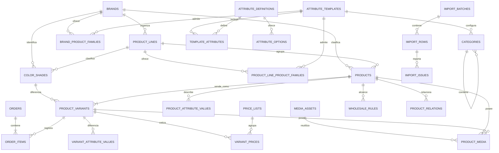

# Bellaroshe · Implementación del Catálogo V2

**Estado:** prototipo funcional en rama `feature/product-data-modeling`  
**Entorno autorizado:** Supabase local (`127.0.0.1:54321`)  
**Producción:** no modificada; despliegue bloqueado hasta validación formal

## 1. Objetivo

La V2 representa productos heterogéneos sin perder rendimiento ni integridad. Todo artículo comprable es una variante, incluso cuando comercialmente exista una sola presentación. La base de datos es la fuente de verdad para jerarquías, atributos tipados, disponibilidad, precios vigentes, mayoristas, medios, relaciones y publicación.

La interfaz es deliberadamente funcional y de baja fidelidad. Sirve para validar el modelo y los flujos de registro, no como acabado visual definitivo.

## 2. Historial de migraciones

| Migración | Responsabilidad |
| --- | --- |
| `0001_initial_catalog_backend.sql` | Historial original exacto de `main`. |
| `0002_columns_and_grants.sql` | Historial original exacto de `main`. |
| `0004_harden_product_image_read_policy.sql` | Historial original exacto de `main`. |
| `0005_catalog_v2.sql` | Modelo aditivo V2, constraints, RLS, índices y backfill V1. |
| `0006_catalog_v2_contracts.sql` | Contratos SQL públicos de listado, detalle, carrito y precios. |
| `0007_admin_orders.sql` | Persistencia administrativa de pedidos y alta transaccional. |
| `0008_product_registration_foundations.sql` | Líneas comerciales y diccionario de plantillas, atributos y categorías para el alta guiada. |
| `0009_scoped_brands_and_color_library.sql` | Asociación muchos-a-muchos de marcas/líneas con familias y biblioteca normalizada de tonos. |
| `0010_enforce_color_shade_scope.sql` | Integridad de marca y línea entre tonos y variantes. |
| `0011_color_family_dictionary.sql` | Diccionario controlado de familias cromáticas para esmaltes. |
| `0012_correct_admiss_family.sql` | Corrección de Admiss como marca de esmaltes, no de tornos. |
| `0013_enamel_content_and_finishes.sql` | Contenido neto numérico/unidad y acabados controlados de esmalte. |
| `0014_conditional_attribute_rules.sql` | Dependencias tipadas entre atributos y validación en base de datos. |
| `0015_product_form_attribute_coherence.sql` | Coherencia integral del formulario: atributos retirados, límites numéricos, rangos y campos dependientes del modo de alimentación. |

Las columnas V1 permanecen durante la transición. No se eliminarán hasta que panel, catálogo, carrito, WhatsApp y PDF estén validados exclusivamente sobre V2.

## 3. Modelo de datos



### Reglas estructurales

- Cada producto operativo tiene exactamente una variante predeterminada activa, protegido por índice parcial y trigger diferible.
- `create_product_with_default_variant` crea producto, variante y precios iniciales en una transacción.
- `replace_default_variant` reemplaza la predeterminada solo por una variante activa del mismo producto.
- Las categorías son únicas por `(parent_id, slug)`, exponen `category_paths` recursiva y rechazan ciclos.
- Los atributos tienen tipo, alcance, opciones controladas y validación contra la plantilla.
- `template_attribute_conditions` modela dependencias tipadas entre atributos. Para esmaltes, `lamp_technology` solo es válido y obligatorio cuando `requires_lamp_v2 = true`; un trigger diferible impide persistir combinaciones incoherentes.
- Los límites definidos en `attribute_definitions.validation_rules` se validan en la interfaz, el servicio y PostgreSQL; las comparaciones mínimo/máximo se modelan en `template_attribute_comparisons`.
- `product_media` tiene exactamente un propietario: producto XOR variante.
- Los precios usan `tstzrange` y una exclusión GiST impide vigencias superpuestas por variante/lista.
- Las reglas mayoristas usan FKs explícitas y exactamente un alcance.
- Las relaciones tienen exactamente un origen y destino; las simétricas se canonizan para evitar `A↔B` duplicado.
- `is_active` es desactivación operativa; `editorial_status` es exclusivamente editorial.

## 4. Estados

Estado editorial de producto:

```text
draft | in_review | published | hidden | incomplete
```

Disponibilidad de variante:

```text
available | sold_out | consult
```

La lectura pública exige simultáneamente `products.is_active = true` y `editorial_status = 'published'`. Una variante `consult` no recibe un precio inventado; pasa al carrito y WhatsApp como consulta.

## 5. Contratos de aplicación

Los contratos viven en `src/lib/catalog/contracts.ts` y están separados del modelo crudo administrativo:

- `CatalogListItem` y `CatalogListResponse` para tarjetas paginadas.
- `CatalogProductDetail` y `PurchasableVariant` para la ficha.
- `CartLine` con identidad `variantId + purchaseMode`.
- `CartEvaluation` para recalcular disponibilidad y mayorista en servidor.
- `WhatsAppOrder` para un único generador de mensajes.
- `PdfCatalogItem` como base de exportación V2.

### API pública

- `GET /api/catalog` — `page`, `page_size`, `search`, `brand`, `category`, `availability`, `attributes`, `sort`.
- `GET /api/catalog/:slug` — detalle completo y variantes activas.
- `GET /api/catalog/taxonomy` — marcas y rutas jerárquicas.
- `POST /api/catalog/cart/evaluate` — precio y regla mayorista canónicos.
- `POST /api/catalog/whatsapp` — mensaje único validado en servidor.

El listado se ejecuta en PostgreSQL, no descarga productos completos ni pagina en el navegador.

## 6. Administración

El objetivo operativo actual es `/admin/productos/nuevo`: registrar un producto sin conocer la estructura interna del catálogo. El módulo `/admin/pedidos` ya implementado se conserva, pero no dirige esta etapa.

`/admin/estructura` ya no muestra el editor técnico de categorías, rutas, plantillas y atributos; redirige a `/admin/productos/nuevo`. Las APIs estructurales se conservan para mantenimiento y pruebas del modelo, pero no forman parte del trabajo diario.

`/admin/productos/nuevo` y `/admin/productos/:id` permiten:

- elegir una de ocho familias comerciales mediante tarjetas;
- resolver categoría y plantilla internamente, sin mostrar rutas técnicas;
- seleccionar o crear una marca desde el mismo formulario;
- seleccionar o crear una línea comercial opcional por marca;
- buscar primero marcas y líneas asociadas a la familia, con resultados acotados y búsqueda global explícita;
- reutilizar la misma marca en varias familias mediante una asociación muchos-a-muchos;
- usar una marca canónica `Genérica / sin marca` en lugar de duplicados por rubro;
- mostrar automáticamente los atributos correspondientes a la familia;
- mostrar solo los campos aplicables según respuestas anteriores y eliminar su valor si dejan de aplicar;
- seleccionar ejes y generar combinaciones;
- crear nuevos valores controlados durante la selección de opciones;
- buscar tonos por nombre/código y familia cromática, o crear un tono contextual por marca/línea;
- agregar explícitamente los tonos seleccionados al producto y completar SKU, precio, disponibilidad e imagen por cada uno;
- elegir un tono o variante principal, explicado como la opción que representa al producto y aparece seleccionada al abrir su ficha;
- crear, duplicar y editar variantes;
- conservar `available`, `sold_out` y `consult`;
- asignar SKU, precios, mínimo mayorista y política de mezcla;
- asociar medios de producto o variante;
- registrar compatibilidad, repuestos, accesorios y recomendaciones;
- duplicar producto;
- guardar borrador, enviar a revisión, ocultar o publicar con confirmación.

La antigua ruta de alta también delega en el RPC atómico; ningún endpoint administrativo crea ya un producto sin variante.

### Pedidos administrativos

- Cada pedido recibe un número correlativo `PED-000000`.
- Se guarda una fotografía de cada línea (SKU, producto, presentación, cantidad, precio y modalidad) para preservar el contexto histórico.
- El alta usa `create_admin_order`, que evalúa el carrito y guarda cabecera y líneas dentro de la misma transacción.
- No se aceptan presentaciones agotadas; las de tipo consulta quedan con importe pendiente.
- Los estados disponibles son `registered`, `confirmed`, `completed` y `cancelled`.
- La lectura y escritura están restringidas a administradores mediante RLS.

## 7. Catálogo, carrito y WhatsApp

El catálogo carga solo datos de tarjeta y el detalle se difiere hasta abrir el producto. La selección local tiene versión de esquema `2`; estados V1 sin `variantId` se ignoran porque no pueden migrarse sin ambigüedad.

Antes de generar WhatsApp, `evaluate_cart_v2` vuelve a consultar:

- variante y disponibilidad;
- precio vigente;
- cantidad agregada por variante, producto, marca y categoría;
- regla mayorista aplicable;
- líneas sin precio que deben consultarse.

El texto de WhatsApp se genera exclusivamente en `src/lib/catalog/whatsapp.ts`.

## 8. PDF V2

`POST /api/admin/pdf/generate` recibe parámetros directos de filtros, obtiene las tarjetas por `catalog_list_v2`, carga productos/variantes/precios/medios en consultas agrupadas y registra:

- parámetros;
- usuario;
- estado;
- archivo;
- fecha;
- error;
- IDs exportados;
- cantidad de productos.

El render admite presentación única o múltiples variantes, precio inicial/rango, consulta, carta de colores, disponibilidad y medios. No se implementó `catalog_views`.

## 9. Importación

La importación está modelada, sin asistente visual:

- `import_batches` guarda el lote y su estado.
- `import_rows` conserva dato bruto, normalizado, decisión y trazabilidad.
- `import_issues` registra severidad y resolución.
- `commit_approved_import_row` convierte una fila aprobada mediante la creación atómica.

El alcance no incluye mapeo visual, corrección masiva ni asociación inteligente de imágenes.

## 10. Seguridad y RLS

- `.env.local` conecta Next.js a Supabase local.
- `.env.supabase.local` es el único archivo cargado por defecto en scripts administrativos.
- `.env.remote.example` documenta remoto sin secretos.
- Todo script de escritura rechaza hosts no locales.
- Remoto exige simultáneamente `--allow-remote` y `--confirm-project=<PROJECT_REF>`.
- `service_role` solo existe en servidor/scripts y nunca usa prefijo `NEXT_PUBLIC_`.
- El público lee únicamente productos activos/publicados, variantes activas, precios públicos vigentes y medios permitidos.
- La escritura depende de Supabase Auth, `admin_profiles` y RLS.

## 11. Rendimiento

Índices cubren publicación, marca, categoría, slug, producto de variante, SKU, disponibilidad, propietarios de medios, listas de precios y atributos filtrables. La búsqueda usa `tsvector`, GIN y trigramas.

El listado público:

- pagina en base de datos;
- filtra en base de datos;
- devuelve conteos y filtros disponibles;
- evita galerías, relaciones, historial y atributos no solicitados;
- carga el detalle mediante un contrato separado.

El PDF usa consultas agrupadas y evita una consulta por producto.

## 12. Seeds demostrativos

Los seeds incluyen:

- esmalte con tonos, familia cromática y mezcla mayorista;
- extensiones con combinación de forma, largo y color;
- torno en modalidad consulta con atributos técnicos y ficha PDF;
- repuesto y accesorio;
- relaciones direccionales y simétricas.

Las rutas de medios `demo/*` son placeholders de Storage; el seed modela asociaciones pero no carga archivos binarios.

## 13. Pruebas

| Comando | Cobertura |
| --- | --- |
| `npm run db:reset:local` | reconstrucción desde `0001` hasta V2 y seeds |
| `npm run test:db` | 23 pruebas pgTAP de constraints, RLS, importación y reglas |
| `npm run test:contracts` | listado, paginación, filtros, detalle, mayorista y consulta |
| `npm run test:backfill` | historia hasta `0004`, fixtures V1, migración y verificación |
| `npm run test:admin-flow` | login real, estructura técnica, producto, carrito, pedido administrativo y PDF |
| `npm run test:product-registration` | marcas acotadas por familia, alta de torno con marca de equipos y tonos de esmalte por marca/línea |
| `npm run test:scale` | 1,505 productos temporales, 16 páginas y limpieza por prefijo |
| `npm run typecheck` | contratos TypeScript |
| `npm run lint` | reglas estáticas |
| `npm run build` | compilación y rutas Next.js |

La prueba de backfill cubre disponible, agotado, consulta, imágenes, carta, PDF, mayorista, columnas V1 e incompletos. Su bloque `finally` siempre restaura la base V2 local.

La prueba de escala publica en lotes de 100 para respetar el tiempo de sentencia de los triggers. En el entorno local de referencia, la consulta de la página final sobre 1,505 coincidencias tardó 867 ms y no truncó resultados.

## 14. Pendientes y criterio de despliegue

Antes de producir una migración destructiva o desplegar se debe confirmar:

- prueba autenticada completa del panel (producto → variantes → publicar → registrar pedido);
- generación y descarga real de PDF con un administrador local;
- prueba visual de escritorio y móvil;
- medición con volumen cercano a 1,500 productos;
- carga real de miniaturas y documentos de demostración;
- respaldo, ventana de despliegue y revisión formal de RLS;
- cero consultas activas a columnas V1.

Solo después se podrá diseñar una migración independiente para retirar columnas V1. No se ejecutará `db push`, seeds ni scripts sobre remoto como parte de esta entrega.
