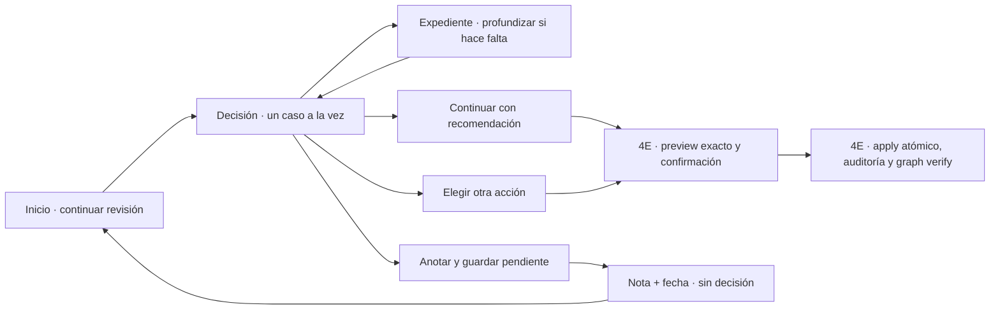

# Etapa 4D · Producto/UX de decisiones humanas

**Baseline remoto 4B/4C:** `52f66de`

**Contrato observado:** `stage4c-v1`

**Estado:** cerrada y aprobada por la propietaria el 2026-08-17; sin frontend ni apply

## Resultado de producto

La experiencia debe permitir que la propietaria responda en menos de un minuto tres preguntas, en este orden:

1. ¿Cuál es el problema y por qué importa?
2. ¿Qué recomendamos y qué problema deja resuelto?
3. ¿Qué ocurrirá con lo confirmado, con lo que aún es dudoso y con el negocio si continúo?

La meta no es reducir la decisión a un clic. Es reducir la carga cognitiva sin ocultar la calidad de evidencia, el alcance ni la trazabilidad.

4D no implementa frontend ni decisiones reales. El prototipo solo cambia de caso, muestra evidencia y ensaya intenciones. Ningún control escribe en PostgreSQL, sincroniza Neo4j o modifica el catálogo. La dirección visual aprobada es exclusivamente clara, con bloques breves y sin párrafos explicativos innecesarios.

## Mejora sobre la propuesta inicial

La arquitectura de tres niveles se conserva reutilizando la experiencia actual de `Catálogo → Revisar`, sin crear una segunda cola ni otro lenguaje visual:

- Nivel 1 es el Inicio existente, que muestra cuánto queda y abre el siguiente caso.
- Nivel 2 conserva el patrón actual de una decisión clara a la vez.
- Nivel 3 reutiliza el Expediente para evidencia e historial.
- La advertencia técnica se traduce según el caso: por ejemplo, **Antes de decidir, confirma este patrón con una ficha técnica**. `HEURISTIC_ONLY` solo aparece en trazabilidad técnica.
- La acción principal se llama **Continuar**, no **Aceptar**. Hasta que 4E defina preview y apply exacto, la UI no sugiere que el clic ya guardó cambios.
- La interfaz usa Manrope, porcelana, rosa Bellaroshé, radios y densidad del panel real; permanece exclusivamente clara.
- La voz de producto dice **Qué recomendamos** y no presenta a Bellaroshé como un tercero.

## Arquitectura de información

| Nivel | Pregunta que responde | Contenido visible | Contenido deliberadamente oculto |
| --- | --- | --- | --- |
| 1 · Inicio | ¿Cuánto queda y cuál sigue? | total pendiente y acción para continuar la revisión | lista técnica, códigos y huellas |
| 2 · Decisión | ¿Entiendo y puedo elegir con seguridad? | el problema, qué recomendamos, qué resuelve, qué pasa si el tipo no está claro, qué no cambia, opciones, comentario y guardado pendiente | fingerprints y trazabilidad exhaustiva |
| 3 · Expediente | ¿Puedo auditar la recomendación? | ejemplo, alcance, evidencia, historial, reglas y huellas | nada técnico relevante |

La información se revela progresivamente; no se duplica en paneles paralelos. El impacto comercial negativo se expresa de forma directa: **no cambia precio, stock ni publicación**.

## Lenguaje humano de las familias

React no traduce `family_code`. La copia validada debe regresar desde el backend como parte de una versión posterior del contrato de presentación.

| Familia técnica | Concepto humano | Verbo de decisión |
| --- | --- | --- |
| `CLASS_RULE_PROMOTION` | Muchos productos parecen seguir la misma regla | Simplificar como regla compartida |
| `ENDPOINT_SCOPE_RECLASSIFICATION` | La clasificación sirve, pero la relación está en el nivel incorrecto | Conservar la clasificación y corregir el alcance |
| `FALSE_PAIR_RETIREMENT` | Hay asociaciones que no deberían seguir considerándose posibles | Retirar asociaciones sin borrar historia |

Los códigos permanecen disponibles únicamente en Evidencia → Trazabilidad técnica.

## Tres casos reales del baseline

El snapshot de validación está en [Casos reales 4D](../research/catalog-master/reports/stage4d-decision-ux/real-cases.json). No contiene casos inventados.

### Regla entre color gel y top

- 19 asociaciones y 19 productos afectados.
- Problema visible: la secuencia color gel → top está guardada producto por producto y debe repetirse cada vez que entra uno nuevo.
- Recomendación: crear una regla para que todo producto confirmado como color gel vaya antes de un top confirmado; no promover pares directos ni hechos canónicos.
- Qué resuelve: un producto nuevo hereda la secuencia solo después de quedar confirmado dentro de su grupo.
- Si el tipo no está claro: queda **por confirmar**, fuera de la regla y sin heredar la relación.
- Mensaje visible: **La regla solo incluirá productos cuyo tipo esté confirmado.**
- Acción recomendada del contrato: `ACCEPT_CLASS_RULE`.

### Alcance de torno y broca

- 38 asociaciones y 20 productos afectados.
- Problema visible: brocas y tornos están relacionados uno por uno cuando la relación corresponde a sus tipos.
- Recomendación: clasificar cada producto como torno o broca y relacionar los tipos; no afirmar compatibilidad producto–producto.
- Qué resuelve: una broca confirmada hereda la relación con el tipo torno sin crear pares nuevos.
- Si el tipo no está claro: queda **por confirmar** y no hereda la relación.
- Mensaje visible: **Nada se tratará como torno o broca si su tipo todavía no está confirmado.**
- Acción recomendada del contrato: `ACCEPT_MEMBERSHIP_SCOPE`.

### Falsos pares con lámpara UV/LED

- 88 asociaciones y 46 productos afectados.
- Ejemplo real: «Esmalte Gel» → «Guantes Para Lámpara UV».
- Problema visible: el nombre «lámpara» hizo entrar accesorios y lámparas de escritorio en el grupo de equipos de curado.
- Recomendación: mantener en el grupo solo equipos de curado confirmados y retirar del conjunto promovible las asociaciones cuyo tipo incorrecto esté confirmado, sin borrar historia.
- Qué resuelve: los accesorios dejan de aparecer como equipos compatibles.
- Si la función no está clara: el producto queda **por confirmar** y esa duda no crea ni retira relaciones.
- Mensaje visible: **Si no está claro que un producto cure gel, quedará pendiente y no se retirará todavía.**
- Acción recomendada del contrato: `ACCEPT_FALSE_PAIR_RETIREMENT`.

Los conteos sustituyen el ejemplo hipotético de 27 productos: el read model certificado devuelve 19 productos para el caso gel, 20 para torno/broca y 46 para lámparas.

## Flujo propuesto

El prototipo 4D termina antes de `G`. La pantalla de confirmación futura debe volver a pedir un preview de backend y no confiar en el estado que React mostró minutos antes.

## Contrato visual por nivel

### Nivel 1 · Inicio

La pantalla existente muestra **18 decisiones pendientes** y abre el siguiente caso mediante **Continuar revisión**. No se añade una lista lateral ni se inventa prioridad, confianza o riesgo mientras el backend no los modele.

### Nivel 2 · Decisión

Orden fijo:

1. **El problema** — `what_was_found` debe explicar la anomalía, no limitarse a contar asociaciones.
2. **Qué recomendamos** — `system_recommendation` debe nombrar la regla, los tipos o las asociaciones que se corrigen.
3. **Qué resuelve** — resultado operativo concreto para productos actuales y futuros.
4. **Si no está claro** — tratamiento explícito de cualquier producto cuyo grupo, tipo o función no esté confirmado.
5. **No cambia** — `impact_preview`, incluidos los ceros comerciales.
6. **Tu siguiente paso** — continuar, otra acción o decidir después.

La intención recomendada se destaca, pero ninguna acción se ejecuta en 4D.

## Decisión no binaria, comentarios y pausa

La propietaria no está obligada a convertir una duda en «sí» o «no». La experiencia distingue tres situaciones:

1. **Ya puede decidir.** Elige una acción y puede añadir un comentario opcional. El comentario viaja con la decisión y queda en auditoría.
2. **La propuesta necesita una corrección.** Elige la acción de ajuste entregada por backend y explica brevemente qué parte debe cambiar. No se aplica la recomendación original; 4E genera un preview nuevo cuando corresponda.
3. **Todavía necesita pensar o comprobar algo.** Usa **Anotar y guardar pendiente**, escribe qué observó o qué información falta y elige cuándo volver a verlo. El caso sigue abierto y no cuenta como aceptado, rechazado ni resuelto.

El botón **Ver otro sin cambiar este caso** solo cambia el caso durante la sesión. No guarda texto. Si existe una nota sin guardar, 4F debe advertir antes de navegar. No habrá autosave invisible: la confirmación **Guardar pendiente** deja claro qué se conserva.

La Mesa actual ya demuestra esta semántica en `0099`: `defer_reason`, `deferred_until`, versión esperada, idempotencia y evento inmutable `work_deferred`; `Catálogo → Revisar` ya ofrece motivo y reaparición en una hora, mañana o siete días. 4E debe reutilizar ese contrato operativo para las decisiones 4C, no crear un segundo mecanismo de borradores.

Al volver al caso se muestra la nota vigente y su historial. Una observación posterior añade historia; no reescribe la anterior. Antes de decidir se solicita otra vez el preview y se comprueba el fingerprint, porque la evidencia puede haber cambiado durante la pausa.

## Producto con grupo o tipo no confirmado

La incertidumbre no se resuelve por semejanza de nombre ni por estar dentro del mismo caso. Un producto dudoso:

- no adquiere membresía de clase ni hereda una relación de clase;
- no genera una relación producto–producto como alternativa provisional;
- permanece como **tipo por confirmar**, equivalente en producto a deuda `NEEDS_EVIDENCE`;
- no crea una tarea humana individual: la deuda sigue automática y, si una causa compartida llega a bloquear una decisión material, se agrupa por esa causa;
- no se incluye silenciosamente en una aplicación parcial ni se retira por descarte.

4D valida que este comportamiento se entienda. 4E debe convertirlo en contrato: el preview separará el subconjunto confirmado del subconjunto dudoso, mostrará ambos conteos y los elementos afectados, y exigirá un fingerprint exacto antes de aplicar. React no calculará, filtrará ni decidirá esa separación.

### Nivel 3 · Expediente

La apertura es opcional y conserva contexto. Debe mostrar:

- ejemplo representativo y alcance;
- productos y relaciones afectadas;
- fuentes, claims y excerpts cuando el contrato los entregue;
- autoridad, requisitos de validación y tipos de entidad;
- trazabilidad técnica: `decision_id`, reglas, fingerprints de snapshot, preview, conjunto y decisión.

## Huecos reales encontrados en 4C

El contrato agregado es suficiente para diseñar Inicio y Decisión, pero no para cerrar el Expediente ni construir 4F:

1. `affected_product_count` no incluye la lista paginada de productos y relaciones.
2. `evidence_summary` no incluye fuentes, claims ni excerpts completos; solo un ejemplo y metadatos agregados.
3. No existe `generated_at`, edad de evidencia o señal explícita de que el preview quedó obsoleto.
4. No existe aún estado persistido de decisión, actor, motivo, auditoría ni resultado.
5. `available_actions` describe intención, pero todavía no define preview de mutaciones, precondiciones ni invalidación.
6. El agregado no separa miembros confirmados de miembros con tipo o función dudosos ni permite explicar qué subconjunto heredaría, conservaría o perdería una relación.
7. Las decisiones 4C todavía no están integradas con el aplazamiento, comentarios e historial de la Mesa existente; el read model solo es de lectura.

Estos huecos no deben rellenarse en React. 4E deberá versionar el detalle de lectura y el contrato de aplicación.

## Validación con la propietaria

Se validan los tres casos en orden alternado para evitar aprendizaje. Para cada caso se mide desde que aparece la decisión hasta que la persona expresa una intención.

Una prueba pasa si:

- en 30 segundos la persona explica con sus palabras qué encontró el sistema;
- en 60 segundos identifica la recomendación y elige una intención;
- reconoce que no cambiarán precio, stock ni publicación;
- entiende qué comprobación concreta falta antes de decidir;
- explica que un producto dudoso queda por confirmar y no hereda ni pierde relaciones;
- puede dejar una observación y guardar el caso pendiente sin fingir una decisión;
- distingue entre comentar una decisión, pedir una corrección y aplazarla;
- entiende la diferencia entre continuar y aplicar;
- encuentra ejemplo y trazabilidad sin ver códigos técnicos antes de pedirlos;
- no solicita revisar individualmente los 19, 38 u 88 pares para comprender el problema.

Cierre 4D: después de rondas iterativas sobre lenguaje, identidad visual, productos dudosos y decisión no binaria, la propietaria autorizó explícitamente el avance continuo el 2026-08-17. La medición instrumentada del recorrido menor a 60 segundos queda como criterio de aceptación de 4F, cuando exista frontend real; no bloquea el contrato backend de 4E. Si falla la copia, se corrige el contrato de presentación; si falta evidencia, se amplía el endpoint de detalle. No se parchea el significado en frontend.

## Frontera de 4E y 4F

4E debe definir por acción: subconjunto confirmado, subconjunto dudoso, comentario de decisión, ajuste solicitado, nota de aplazamiento, fecha de reaparición, registros creados o modificados, historia preservada, fingerprint obligatorio, causas de invalidación, preview de impacto, transacción, auditoría, proyección a Neo4j y respuesta ante evidencia concurrente. Ninguna aplicación podrá inferir membresía desde React ni incluir por defecto un producto dudoso. La secuencia obligatoria es:

`preview → fingerprint → decisión humana → apply exacto → auditoría → graph sync → verify`.

4F implementará `Catálogo → Revisar` únicamente cuando 4D haya sido validada y 4E esté certificada. React mostrará contratos, enviará una intención y renderizará el resultado; nunca encadenará varios `UPDATE` ni reconstruirá reglas.

La expansión masiva de marcas y sistemas queda después de demostrar que una persona puede gobernar estas decisiones.
